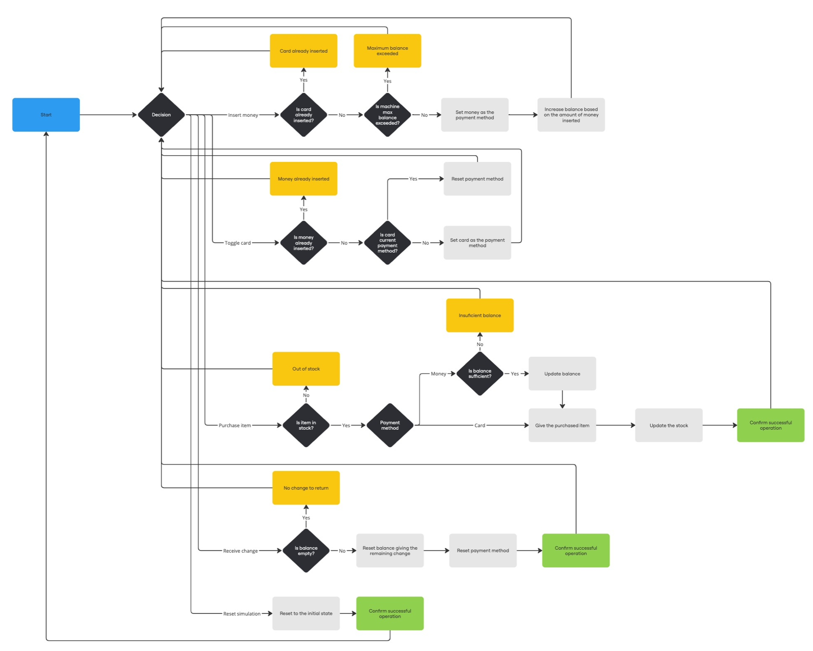

# Vending Machine

## Overview

1. 자판기에서 사용자가 원하는 음료수를 얻기까지의 메카니즘의 다이어그램을 그려봅니다. (자율양식)
2. 1 에서 작성한 주요로직을 프로그래밍 언어로 표현합니다 (자율양식)

## Getting Started

To set up and run the project locally, follow these steps:

1. Install dependencies:

   ```bash
   npm i
   ```

2. Run the project:

   ```bash
   npm run dev
   ```

3. Open [http://localhost:3000](http://localhost:3000) with your browser to see the result.

## Details

#### How It Works

- The user can choose to pay using money (coins/bills) or card.
- If the user inserts money, the balance will keep increasing as they insert more.
- If the user chooses card, the exact price of the selected product will be charged.
- Purchases deduct the balance when paying with money.
- The user can purchase multiple items as long as they have enough balance.
- Change is not given automatically after a purchase → the user must manually press the coin button to retrieve change.
- To reset the simulation, click the top-right icon.

#### Assumptions

- If the user chooses card payment, we assume they have enough balance.
- The vending machine always has enough change to give back to the user.
- The user cannot insert both money and a card in the same transaction.
- The vending machine has a fixed capacity for how much money it can hold at a time.

#### Edge Cases Covered

- Trying to insert a card after inserting money → The card will be refused, as money payments do not require card.
- Inserting more money than the vending machine can hold → The last transaction will be rejected.
- Trying to insert money after selecting card payment → The money will be refused, as card payments do not require cash.
- Selecting an item that is out of stock → A message will inform the user that the item is unavailable.
- Attempting to buy an item without enough balance → The purchase will be rejected.
- Trying to retrieve change when there is no change to give → The request will be ignored, preventing unnecessary actions.

## Note

If you require any further clarification or additional information regarding the code, please do not hesitate to contact me.


