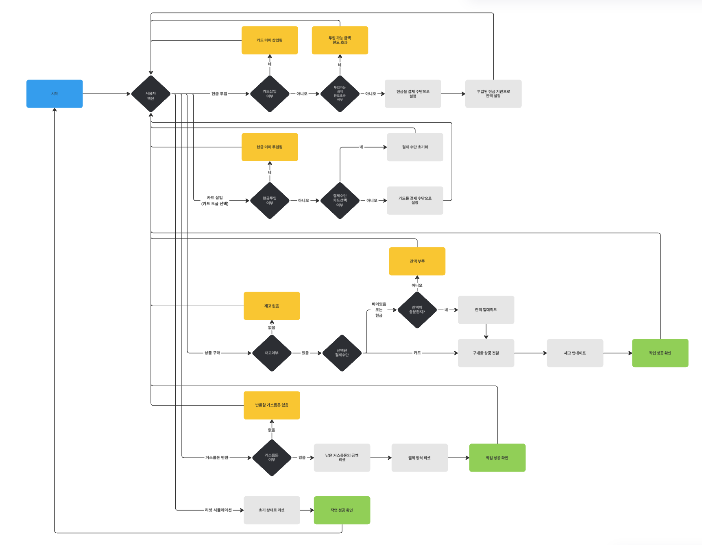
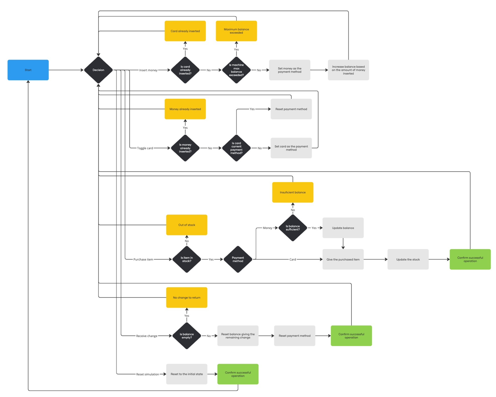

# 자판기

## 개요

이 프로젝트는 사용자가 현금 또는 카드를 사용하여 음료수를 구매할 수 있는 자판기의 동작을 시뮬레이션합니다. 거래 흐름의 다이어그램이 포함되어 있습니다.

## 시작하기

이 프로젝트를 로컬에서 설정하고 실행하려면 다음 단계를 따르세요:

1. 의존성 설치:

   ```bash
   npm i
   ```

2. 프로젝트 실행:

   ```bash
   npm run dev
   ```

3. 브라우저에서 [http://localhost:3000](http://localhost:3000)을 열어 결과를 확인하세요.

## 세부사항

#### 동작 원리

- 사용자는 현금(동전/지폐) 또는 카드를 사용하여 결제할 수 있습니다.
- 사용자가 현금을 삽입하면 투입 가능 금액을 초과하기 전까지 잔액이 계속 증가합니다.
- 사용자가 카드를 선택하면 선택한 제품의 정확한 가격이 청구됩니다.
- 현금 결제 시, 구매 금액이 잔액에서 차감됩니다.
- 사용자는 잔액이 충분한 한 여러 개의 제품을 구매할 수 있습니다.
- 구매 후 거스름돈은 자동으로 제공되지 않습니다. → 사용자가 동전 버튼을 눌러 거스름돈을 수동으로 가져가야 합니다.
- 시뮬레이션을 초기화하려면 오른쪽 상단 아이콘을 클릭하세요.

#### 가정

- 사용자가 카드 결제를 선택하면 결제에 필요한 충분한 잔액이 있다고 가정합니다.
- 자판기는 항상 사용자에게 거스름돈을 줄 수 있는 충분한 동전을 가지고 있다고 가정합니다.
- 사용자는 동일한 거래에서 현금과 카드를 동시에 삽입할 수 없습니다.
- 자판기는 한 번에 투입할 수 있는 현금 금액에 한계가 있습니다.

#### 처리된 예외 사항

- 현금을 삽입한 후 카드를 삽입하려고 할 경우 → 현금 결제에는 카드가 필요 없으므로 카드가 거부됩니다.
- 자판기가 보유할 수 있는 금액 이상으로 돈을 삽입하려고 할 경우 → 마지막 거래가 거부됩니다.
- 카드 결제를 선택한 후 현금을 삽입하려고 할 경우 → 현금 결제는 카드 결제와 함께 사용할 수 없으므로 돈이 거부됩니다.
- 재고가 없는 제품을 선택하려고 할 경우 → 해당 제품이 품절되었다는 메시지가 표시됩니다.
- 잔액이 부족하여 제품을 구매할 수 없을 경우 → 구매가 거부됩니다.
- 거스름돈이 없는데 거스름돈을 요청할 경우 → 요청은 무시되어 불필요한 작업을 방지합니다.

## 주의 사항

코드에 대한 추가적인 설명이나 정보가 필요하면 언제든지 연락주세요.



# Vending Machine

## Overview

This project simulates the operation of a vending machine, allowing users to purchase drinks using either cash or card. It includes a detailed diagram of the transaction flow.

## Getting Started

To set up and run the project locally, follow these steps:

1. Install dependencies:

   ```bash
   npm i
   ```

2. Run the project:

   ```bash
   npm run dev
   ```

3. Open [http://localhost:3000](http://localhost:3000) with your browser to see the result.

## Details

#### How It Works

- The user can choose to pay using money (coins/bills) or card.
- If the user inserts money, the balance will keep increasing until it reaches a limit.
- If the user chooses card, the exact price of the selected product will be charged.
- Purchases deduct the balance when paying with money.
- The user can purchase multiple items as long as they have enough balance.
- Change is not given automatically after a purchase → the user must manually press the coin button to retrieve change.
- To reset the simulation, click the top-right icon.

#### Assumptions

- If the user chooses card payment, we assume they have enough balance.
- The vending machine always has enough change to give back to the user.
- The user cannot insert both money and a card in the same transaction.
- The vending machine has a fixed capacity for how much money it can hold at a time.

#### Edge Cases Covered

- Trying to insert a card after inserting money → The card will be refused, as money payments do not require card.
- Inserting more money than the vending machine can hold → The last transaction will be rejected.
- Trying to insert money after selecting card payment → The money will be refused, as card payments do not require cash.
- Selecting an item that is out of stock → A message will inform the user that the item is unavailable.
- Attempting to buy an item without enough balance → The purchase will be rejected.
- Trying to retrieve change when there is no change to give → The request will be ignored, preventing unnecessary actions.

## Note

If you require any further clarification or additional information regarding the code, please do not hesitate to contact me.


